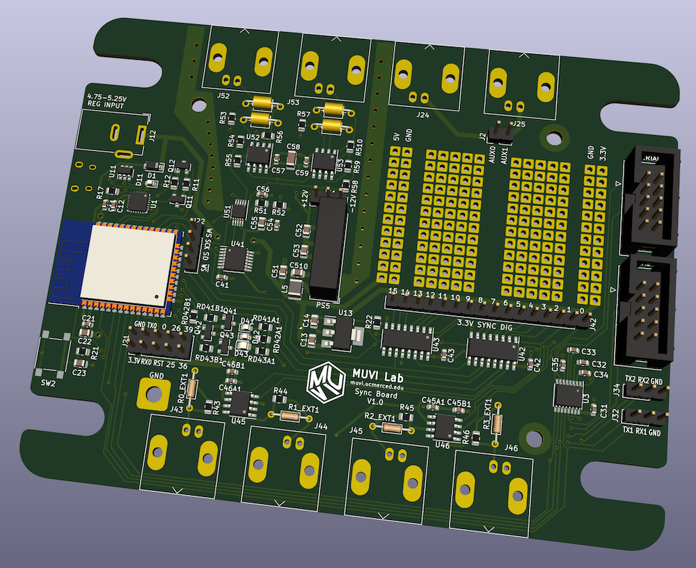

# ad_sync
Hardware and software design for a USB-based analog/digital synchronizer board.  Developed by the MUVI and Kleckner Labs at UC Merced.

## Description
This project is intended to solve a specific problem: synchronizing a laser scanner and camera setup for 3D volumetric imaging.
To do this, it outputs hardware synchronized digital and analog signals.
The hardware works by converting a single digital bit stream from the on board ESP32 processor to a series of shift registers and a digital-to-analog converter (with ± 10V range).
The update rate is tunable from 30 Hz to 700 kHz, with a ~10 PPM accurate clock (provided by the APLL clock on the ESP32).

The hardware, firmware and software required to run the board is all stored in this repository, with an Apache license.
If you would like to fabricate, modify, or just use these boards, get in touch!

## Features
* 16 synchronized digital outputs.  Four are converted to 5 V and output on external BNC or header pin connections
* 2 synchronized analog outputs, output on BNC or header pins
* 2 auxiliary serial ports (RS-232 levels), tunneled through the main connection, and which can be used to control additional devices
* An RGB output LED, controllable through software, to be used as an indicator light
* A small on-board prototyping area, to add additional functionality
* Pin headers for various on board signals, including unused GPIO ports on the microcontroller.  (These are not usable without a firmware modification.)
* Everything is controlled through a USB port *or* Bluetooth conncection, with simple serial commands.  (To enable bluetooth, use `set_bt_name.py`.)
* In the future, a firmware update may also provide a wifi connection option; the microcontroller is capable of this but the feature has not been coded)

## Project Progress
* [x] Initial board schematics
* [x] Fabricate test hardware
* [x] Feature complete firmware
* [x] USB communications
* [x] Python driver
* [ ] Wifi connection
* [x] Bluetooth connection
* [x] Aux. serial port connections
* [ ] Experimental testing and validation

## Contents
This project contains four directories:
* `hardware`: the hardware schematics and PCB layout.
* `hardware_fab`: the PCB design output files, which can be sent directly to a board fabricator.
* `firmware`: the Arduino/C++ firmware for the driver board, as a PlatformIO project.  (Note: currently in alpha status.)
* `ad_sync`: a Python library to interface with the board through USB. (Note: currently empty.)

## Python Interface
The device is most easily controlled with the provided Python library.
All of the functions are illustrated in `test.py`, located in this directory.

All of the functions in the communication protocol (described below), also have a corresponding python method with a similar or identical name.

## Description of Synchronized Outputs
The synchronized outputs are fed from an internal memory of up to 16384 samples.
Each sample is a 32 bit unsigned integer.
The high 16 bits are the digital channels, and the low 16 bits are an analog sample.
Typically, the analog sample should contain the full data range (0-65535), and can be dynamically scaled as the signal is generated.
(This way you don't need to upload entirely new data to offset or rescale the analog signal.)

To specify an output, you first upload an arbitrary amount of data (in Python, use the `write_ad` method).
You then tell the device where to read from in memory, by specifying a start address and number of samples (`addr` method).
Additionally, you can specify the output rate in samples/s (`rate` method).

Finally, you can specify that certain digital channels are triggered.
Triggered channels will remain low until a trigger is specified (`trigger` method).
Note that the trigger always starts on the beginning of an output cycle, and can be for one or more cycles.

## Communication Protocol
Although the Python library is convenient, it is also possible to talk to the board directly with serial commands through the USB interface (and eventually: bluetooth and wifi, which will use a serial bridge).

**Command structure:** one to three "words", at most four letters each, followed by 0-3 integers.  Some commands are also followed by arbitrary length binary data.  
All commands are terminated with a linefeed character (`⏎`; this is equivalent to `"\n"` in Python or C).  

The format for binary appended data is `>[number of bytes]>[binary data]`, and should followed by a line feed character.

Note that if the word is longer than 4 letters the extra letters are ignored.
In other words `SYNC AVAIL` is the same as `SYNC AVAI` (or even `SYNC AVAILABLE` if you prefer).  
Lower case letters are converted to upper case internally (i.e. `SynC AvAiXXX` is also equivalent.)

Unless specified otherwise, commands return `ok.⏎` on success.
Error strings will always begin with `ERROR:` and end with `⏎`.

*Note:* For the command words `ANA0`, `ANA1`, `SER1`, and `SER2` there is no space between the letters and number -- this number is part of the command, not an argument!
(If you're wondering why the serial numbering starts with 1: this is because serial 0 is the USB connection.)

### List of Serial Commands
Parameters are specified in square brackets, and correspond to unsigned integers (exception: commands which have an `ON/OFF` option).

**Misc Commands**
* `*IDN⏎`: Returns the identification string for the synchronizer.  (Presently: `USB analog/digital synchronizer (version 1.0)⏎`)
* `LED [r] [g] [b]⏎`: Set the color of the RGB indicator LED.  Each value should be 0-255, and the output is gamma corrected.

**Sync Output Commands**
* `SYNC STAT⏎`: Outputs statistics on the sync DMA buffer output.  Used for debugging, but shouldn't normally be needed.
* `SYNC WRITE [addr] >[n]>[binary data]⏎`: Write synchronous data starting at indicated address (addr < 16384).  
    - Each data point is four bytes, or a uint32.  The highest two bytes are the digital outputs for that sample and the lowest two bytes are the analog signal.  Note that the microcontroller is little-endian, thus the byte order should be `[analog low][analog high][digital low][digital high]`.  
    - The data written should have a length which is a multiple of 4 bytes, but this is not enforced!  (A warning will be issued if this condition is not met.)  There is no padding between samples, and you can upload as many as you want at once.
    - Ideally, the analog data should span the full 0--65535 range.  The amplitude and offset of the output can be controlled with the `ANA[0/1] SCALE` command, so that you don't have to reupload data to rescale the analog output.
* `SYNC [START/STOP]⏎`:
    - Start/stop the synchronous digital outputs by enabling or disabling the shift register outputs and stopping the sync updates.
    - When stopped, the analog channels will default to the values set by `ANA[0/1] SET`.
* `SYNC MODE [analog mode] [digital mode (optional)]⏎`: Set the mode of the sync output.  
	- Analog mode options:
		- `0`: No sync analog output; each channel goes to the default (set w/ `ANA[0/1] SET`)
		- `1`: Analog 0 streams from sync data, analog 1 fixed value (default)
		- `2`: Analog 1 streams from sync data, analog 0 fixed value
		- `3`: Both channels stream, alternating updates.  Even sync data addresses go to analog 0, odd address to analog 1.  Note that this halves the update rate of each channel, relative to the digital signals.
	- Digital mode options:
		- `0`: All 16 outputs derived from sync data (default)
		- `1`: "Or" mode.  Channels 0-7 are logical "or"ed with channels 8-15.  8-15 have the normal output.  (Can be used to superimpose triggered and non-triggered signals.)
* `SYNC ADDR [addr] [count]⏎`: Change the start address and number of data points for a period of the sync output.
* `SYNC ADDR⏎`: Returns the current sync mode (`SYNC CYCLE [addr] [count]⏎`)
* `SYNC RATE [rate Hz] [rate mHz (optional)]⏎`:
    - Change the synchronous output rate, specified in Hz, with any optional millihertz addition.  (i.e. 100.5 Hz would be specified as `SYNC RATE 100 005⏎` or `SYNC RATE 100 5⏎`.)  Valid values are from 30 to 700000.  
    - Replies with `SYNC RATE = [samples/s] Hz⏎`.  Note that [samples/s] will here be floating point, and reflects the actual frequency as set by the device (will likely be *slightly* different than the requested value)
    - Accuracy/precision is ~10 PPM, as determined by main clock accuracy.
* `ANA[0/1] SCALE [scale] [offset]⏎`:
    - Change the output scale and offset of this channel.  Each scale/offset should be from 0-65536 and covers the range of -10 to 10 V.  
    - `scale` indicates the peak to peak amplitude of the signal (65536 = 20 V peak-to-peak, 3277 = 1.0000 V peak-to-peak)
    - `offset` is the minimum value of the signal (0 = -10 V, 65536 = 10V, 32768 = 0V.)  
    - *Note:* the above scaling assumes the input waveform goes from 0-65535 in the sync data.  If it does not, it will be proportionally smaller.
* `ANA[0/1] SET [value]⏎`:
    - Directly set the analog output value for one of the channels (0=-10V, 65536 = +10V).  No scaling or offset is applied.  
    - *Note 1:* Command ignored if this channel is currently updating synchronously.  
    - *Note 2:* Updating while the sync is running on the other channel will introduce a one sample skip in the output of the synced channel.

**Serial Commands**
* `SER[1/2] WRITE >[n]>[binary data]⏎`: Write `n` bytes to serial port 1/2.  Replies with: `Wrote [n] bytes of data to serial [1/2].⏎`
* `SER[1/2] READ [n (optional)]⏎`:
    - Read at most `n` bytes of data from serial port 1/2  
    - If `n` is not specified (or `n` is greater than the amount of available data), return all available data.  
    - Call is non-blocking: it will not wait for data to be available
    - Reply format is `>[n]>[n bytes of binary]⏎`  
* `SER[1/2] AVAIL⏎`: Return the number of bytes available to be read at that serial port.  Reply format: `[n]⏎`
* `SER[1/2] FLUSH⏎`: Flush the read buffer for a serial port.
* `SER[1/2] RATE [baud rate]⏎`:
    - Set the baud rate for a serial port  
    - The serial format is always 8 bits with a start and stop bit.  (This could be changed by altering the firmware, if needed.)
    - *Note:* Changing the Baud rate of Serial Port 1 will cause an output glitch on the sync outputs.  Unfortunately this is a hardware bug on the microcontroller, which is not correctable!

**Trigger Commands**
* `TRIGER MASK [bit mask]⏎`: A bit mask indicated if each digital output channel is triggered.  Triggered channels output low until triggered.
* `TRIGER [cycles (optional)]⏎`: Activate the trigger for the specified number of cycles.  `cycles=1` is the default.  Note that there may be a delay of up to 256 samples in outputting a triggered signal, due to the output buffering.  Also, triggers always begin at the beginning of a cycle.

**Bluetooth Commands**
* `BLUETOOTH >[n]>[bluetooth name]⏎`:
    - Set the name of the bluetooth device, and enables it
    - Name will be saved to internal flash storage, and will remain after a reboot
    - Name needs to be sent as binary, should be <= 64 bytes (or an error is raised)
    - Replies with `Bluetooth enabled with name: [bluetooth name]⏎`
    - Setting the name to an empty string disables the device (e.g. `BLUETOOTH⏎`)
